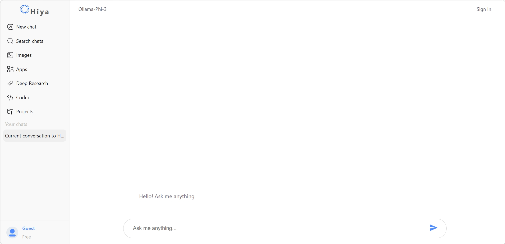
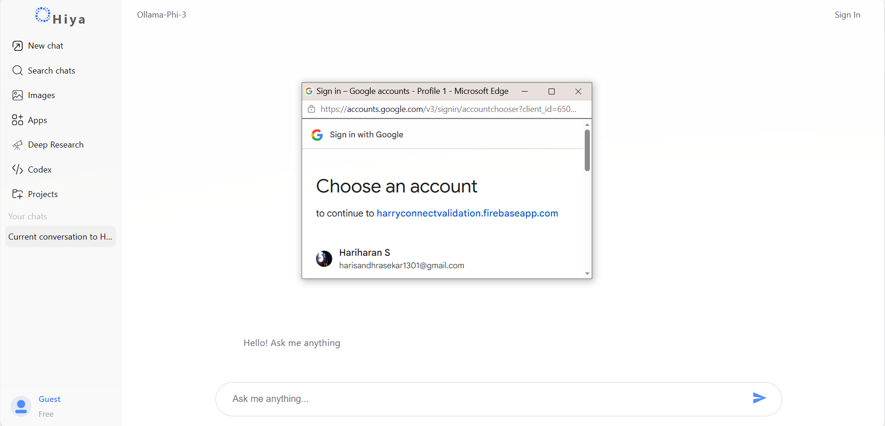
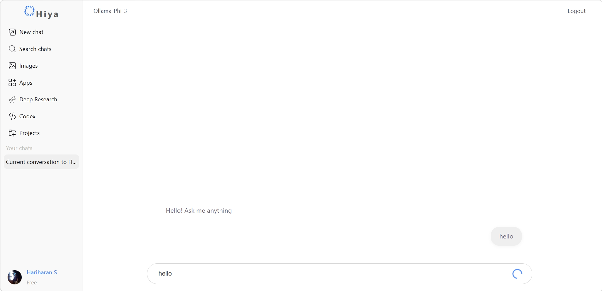
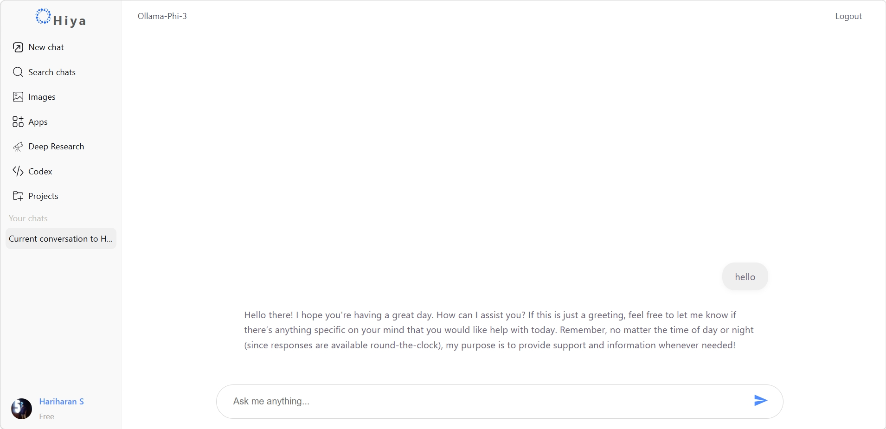

<!-- PROJECT TITLE -->
# Hiya Chat Assistant Frontend

---

<!-- PROJECT OVERVIEW -->
## Project Overview

Hiya Chat Assistant Frontend is a modern, user-friendly interface for an AI-powered chat assistant. It enables seamless communication with a backend API, displaying intelligent responses in a real-time chat UI. Designed for both clients and developers, this project leverages cutting-edge web technologies to deliver a robust, scalable, and visually appealing chat experience.

**Backend Repository:** [Hiya Chat Assistant Backend](https://github.com/Hariharan-S5/Hiya-Chat-Assistant-Backend.git)

---

<!-- KEY FEATURES -->
## Key Features

| Feature                | Description                                              |
|-----------------------|----------------------------------------------------------|
| Real-Time Chat        | Instant messaging with AI-powered responses              |
| API Integration       | Communicates with backend via REST APIs                  |
| Responsive UI         | Optimized for desktop and mobile devices                 |
| User-Friendly Design  | Clean, intuitive interface for easy interaction          |
| Sidebar Navigation    | Quick access to chat histories and settings              |
| Message History       | Persistent chat history for user sessions                |
| Customizable Styles   | Easily adaptable CSS for branding                        |
| Developer Friendly    | Modular codebase, clear structure, and documentation     |

---

<!-- TECH STACK -->
## Tech Stack
- **Auth:** Firebase Authentication (Google Sign-In)
- **Frontend:** React, Vite
- **Language:** JavaScript (ES6+)
- **Styling:** CSS, CSS Modules
- **API:** RESTful communication
- **Build Tool:** Vite

---

<!-- PROJECT ARCHITECTURE -->
## Project Architecture

```
	    [User Interface]
				|
				v
	    [Application Logic]
				|
				v
	    [API Communication]
				|
				v
	      [Backend API]
```

---

<!-- PROJECT STRUCTURE -->
## Project Structure (Folder Tree)

```
HarryConnect/
├── public/
├── src/
│   ├── App.jsx
│   ├── App.css
│   ├── ChatInputBox.jsx
│   ├── ChatInputBox.css
│   ├── ChatMessageList.jsx
│   ├── ChatMessageList.css
│   ├── Sidebar.jsx
│   ├── Sidebar.css
│   ├── firebase.js
│   ├── index.css
│   ├── main.jsx
│   └── assets/
├── index.html
├── package.json
├── vite.config.js
├── eslint.config.js
├── chat_histories.json
└── README.md
```

---

## Authentication Flow (Google Auth using Firebase)

1. User clicks "Sign in with Google".
2. Firebase Authentication handles Google OAuth.
3. On success, user is logged in and can access chat features.
4. User session is managed securely.


Example (in `firebase.js`):
```js
import { getAuth, signInWithPopup, GoogleAuthProvider } from "firebase/auth";
const auth = getAuth();
const provider = new GoogleAuthProvider();
signInWithPopup(auth, provider)
	.then((result) => {
		// User signed in
	})
	.catch((error) => {
		// Handle errors
	});
```


<!-- INSTALLATION GUIDE -->
## Installation Guide

1. **Clone the repository:**
	 ```bash
	 git clone gh repo clone Hariharan-S5/Hiya-Chat-Assistant-Frontend
	 cd Hiya-Chat-Assistant-Frontend
	 ```
2. **Install dependencies:**
	 ```bash
	 npm install
	 ```
---

## Firebase configuration

Update `src/firebase.js` to use these variables.
```.js
apiKey=your_api_key
authDomain=your_auth_domain
projectId=your_project_id
storageBucket=your_storage_bucket
messagingSenderId=your_sender_id
appId=your_app_id
measurementId = your_measurement_id
```


---

<!-- RUNNING THE APPLICATION -->
## Running the Application

Start the development server:
```bash
npm run dev
```

Open your browser and navigate to [http://localhost:5173](http://localhost:5173) (default Vite port).

---


<!-- FRONTEND APPLICATION FLOW -->
## Frontend Application Flow

1. **User enters a message** in the chat input box.
2. **Message is sent** to the backend API via REST call.
3. **AI response is received** and displayed in the chat UI.
4. **Chat history is updated** and persisted for the session.

---

<!-- API INTEGRATION -->
## API Integration (Backend Communication)

- Uses `fetch` or `axios` to communicate with backend REST API.
- Example API call:
	```js
	fetch(`${process.env.VITE_API_URL}/chat`, {
		method: 'POST',
		headers: { 'Content-Type': 'application/json' },
		body: JSON.stringify({ message: userInput })
	})
		.then(res => res.json())
		.then(data => setChatResponse(data.response));
	```
- Handles authentication and error states as needed.

---

<!-- UI COMPONENTS OVERVIEW -->
## UI Components Overview

| Component         | Purpose                                      |
|-------------------|----------------------------------------------|
| App.jsx           | Main app container, routing, layout           |
| ChatInputBox.jsx  | User input field for chat messages            |
| ChatMessageList.jsx | Displays chat messages and AI responses     |
| Sidebar.jsx       | Navigation, chat history, settings            |
| firebase.js       | Firebase integration (if used)                |
| assets/           | Static assets (images, icons, etc.)           |

---

<!-- DEVELOPMENT GUIDELINES -->
## Development Guidelines

- Follow [Airbnb JavaScript Style Guide](https://github.com/airbnb/javascript) (ESLint configured)
- Use functional React components and hooks
- Keep components modular and reusable
- Write clear, concise comments and documentation
- Use descriptive commit messages
- Test changes locally before pushing
- Pull requests should reference related issues

---

<!-- BUILD & DEPLOYMENT -->
## Build & Deployment

Build the production bundle:
```bash
npm run build
```

Deploy the `dist/` folder to your preferred static hosting provider (e.g., Vercel, Netlify).

---

<!-- FUTURE IMPROVEMENTS / ROADMAP -->
## Future Improvements / Roadmap

- Enhanced AI response accuracy
- User authentication and profiles
- Multi-language support
- Advanced chat analytics
- Custom themes and branding
- Mobile app integration

---


<!-- OUTPUT SCREENSHOTS -->
## Output Screenshots

Below are example screenshots of the Hiya Chat Assistant Frontend UI:






---

<!-- MAINTAINER / CONTACT -->
## Maintainer / Contact

| Name      | Contact                |
|-----------|------------------------|
| Your Name | harisandhrasekar1301@gmail.com |

For questions, issues, or feature requests, please open an issue or contact the maintainer directly.
